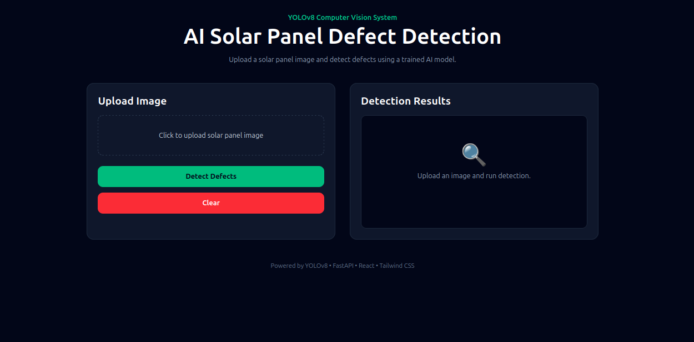
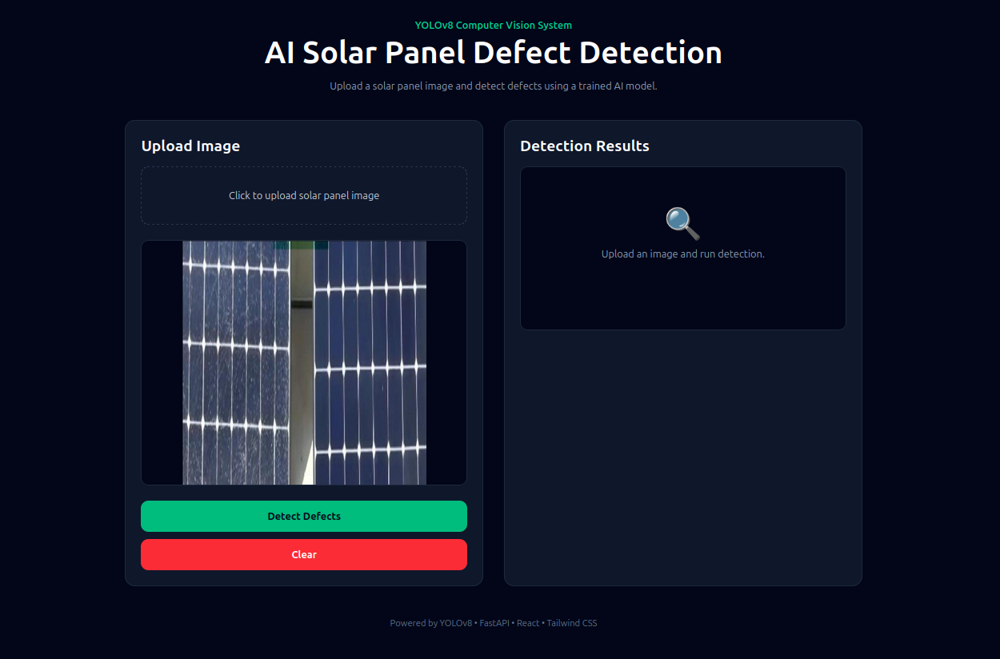
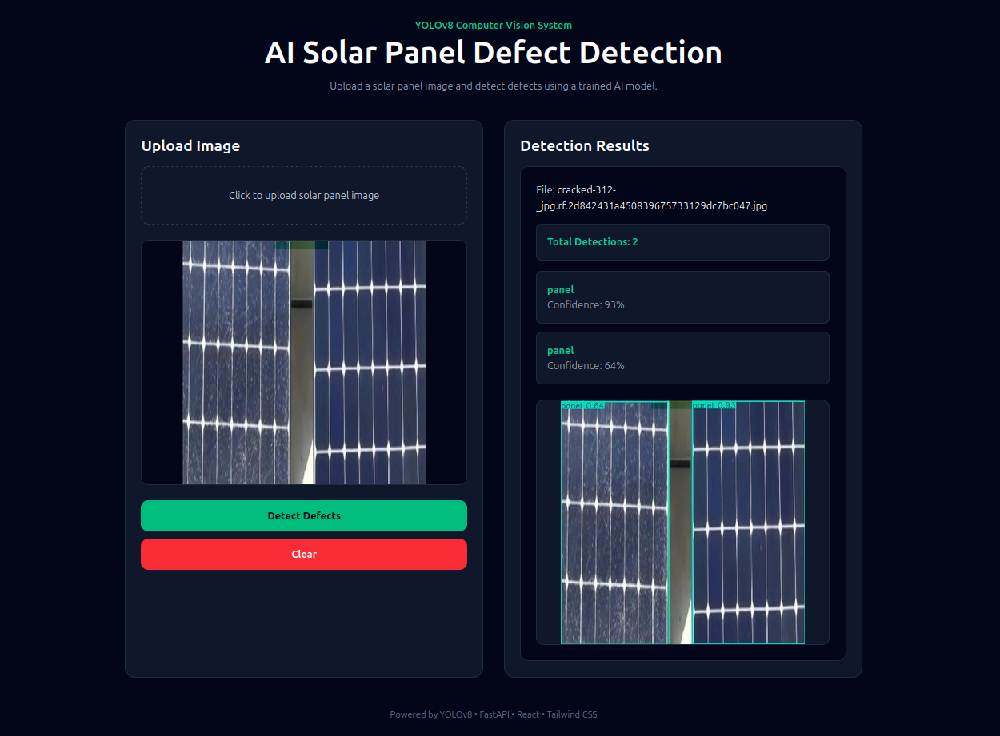

# AI Solar Panel Defect Detection System


An AI-powered computer vision system that automatically detects defects in solar panels using YOLOv8 object detection. The project provides a FastAPI backend for inference and a React frontend for image upload, visualization, and defect analysis.

---

## Features

- Detect solar panel defects from images
- YOLOv8-based object detection
- FastAPI REST API
- React + Vite frontend
- Annotated prediction images
- Confidence score reporting
- Upload and analyze solar panel images
- Real-time defect visualization

---

## Tech Stack

### Backend
- Python
- FastAPI
- Uvicorn
- YOLOv8 (Ultralytics)

### Frontend
- React
- Vite
- CSS

### AI / Computer Vision
- PyTorch
- YOLOv8
- OpenCV

---

## Dataset

Solar Panel Defect Dataset from Roboflow Universe.

Classes:

- bird_drop
- cracked
- dusty
- panel

Dataset Split:

- Train: 4546 images
- Validation: 1299 images
- Test: 648 images

---

## System Architecture

User
↓
React Frontend
↓
FastAPI Backend
↓
YOLOv8 Model
↓
Defect Detection
↓
Prediction Results + Annotated Image

---

## Project Structure

```text
ai-solar-panel-defect-detection/
│
├── backend/
│   ├── app/
│   │   ├── model/
│   │   │   ├── predict.py
│   │   │   └── weights/
│   │   │       └── best.pt
│   │   ├── schemas/
│   │   ├── config.py
│   │   └── main.py
│   │
│   ├── uploads/
│   └── predictions/
│
├── frontend/
│   ├── src/
│   └── public/
│
├── docs/
├── screenshots/
├── README.md
└── requirements.txt
```

## API Endpoint

### POST /predict

Upload an image for defect detection.

Request:

```bash
curl -X POST \
http://127.0.0.1:8000/predict \
-F file=@solar_panel.jpg
```

Response:

```json
{
  "filename": "solar_panel.jpg",
  "detections": [
    {
      "class": "cracked",
      "confidence": 0.95
    }
  ],
  "prediction_image": "/predictions/result.jpg"
}
```

---

## Installation

### Clone Repository

```bash
git clone https://github.com/m-musif/AI-Solar-Panel-Defect-Detection.git
cd AI-Solar-Panel-Defect-Detection
```

### Backend Setup

```bash
python -m venv venv

source venv/bin/activate

pip install -r requirements.txt

uvicorn backend.app.main:app --reload
```

### Frontend Setup

```bash
cd frontend

npm install

npm run dev
```

---

## Example Detection

Detected Defect:

- Cracked Panel
- Confidence: 95%

---

## Screenshots

### Home Page



### Image Upload



### Detection Results



---

## Future Improvements

- Thermal image support
- Drone integration
- Batch image processing
- Defect severity estimation
- Cloud deployment
- Mobile application

---

## Author

Muhammad Musif

GitHub:
https://github.com/m-musif

LinkedIn:
https://www.linkedin.com/in/muhammad-musif-b62732331/
